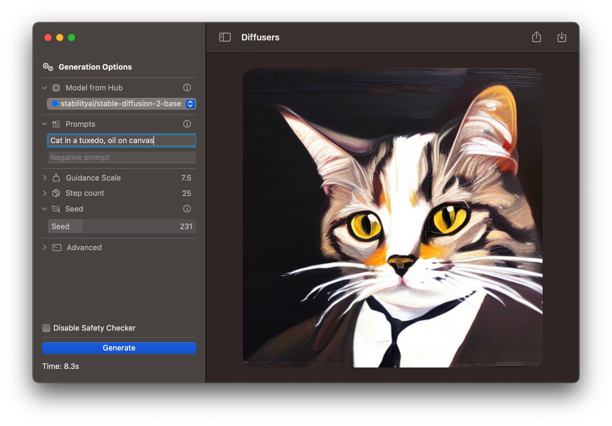

#  Swift Core ML Diffusers 🧨

This is a native app that shows how to integrate Apple's [Core ML Stable Diffusion implementation](https://github.com/apple/ml-stable-diffusion) in a native Swift UI application. The Core ML port is a simplification of the Stable Diffusion implementation from the [diffusers library](https://github.com/huggingface/diffusers). This application can be used for faster iteration, or as sample code for any use cases.

This is what the app looks like on macOS:

On first launch, the application downloads a zipped archive with a Core ML version of Stability AI's Stable Diffusion v2 base, from [this location in the Hugging Face Hub](https://huggingface.co/pcuenq/coreml-stable-diffusion-2-base/tree/main). This process takes a while, as several GB of data have to be downloaded and unarchived.

For faster inference, we use a very fast scheduler: [DPM-Solver++](https://github.com/LuChengTHU/dpm-solver) that we ported to Swift from our [diffusers DPMSolverMultistepScheduler implementation](https://github.com/huggingface/diffusers/blob/main/src/diffusers/schedulers/scheduling_dpmsolver_multistep.py), with a number of simplifications.

## Compatibility and Performance

- macOS Ventura 13.1, iOS/iPadOS 16.2, Xcode 14.2.
- Performance (after the initial generation, which is slower)
  * ~8s in macOS on MacBook Pro M1 Max (64 GB). Model: Stable Diffusion v2-base, ORIGINAL attention implementation, running on CPU + GPU.
  * 23 ~ 30s on iPhone 13 Pro. Model: Stable Diffusion v2-base, SPLIT_EINSUM attention, CPU + Neural Engine, memory reduction enabled.

See [this post](https://huggingface.co/blog/fast-mac-diffusers) and [this issue](https://github.com/huggingface/swift-coreml-diffusers/issues/31) for additional performance figures.

The application will try to guess the best hardware to run models on. You can override this setting using the `Advanced` section in the controls sidebar.

## How to Run

The easiest way to test the app on macOS is by [downloading it from the Mac App Store](https://apps.apple.com/app/diffusers/id1666309574).

## How to Build

You need [Xcode](https://developer.apple.com/xcode/) to build the app. When you clone the repo, please update `common.xcconfig` with your development team identifier. Code signing is required to run on iOS, but it's currently disabled for macOS.

## Known Issues

Performance on iPhone is somewhat erratic, sometimes it's ~20x slower and the phone heats up. This happens because the model could not be scheduled to run on the Neural Engine and everything happens in the CPU. We have not been able to determine the reasons for this problem. If you observe the same, here are some recommendations:
- Detach from Xcode
- Kill apps you are not using.
- Let the iPhone cool down before repeating the test.
- Reboot your device.

## Next Steps

- Allow additional models to be downloaded from the Hub.
